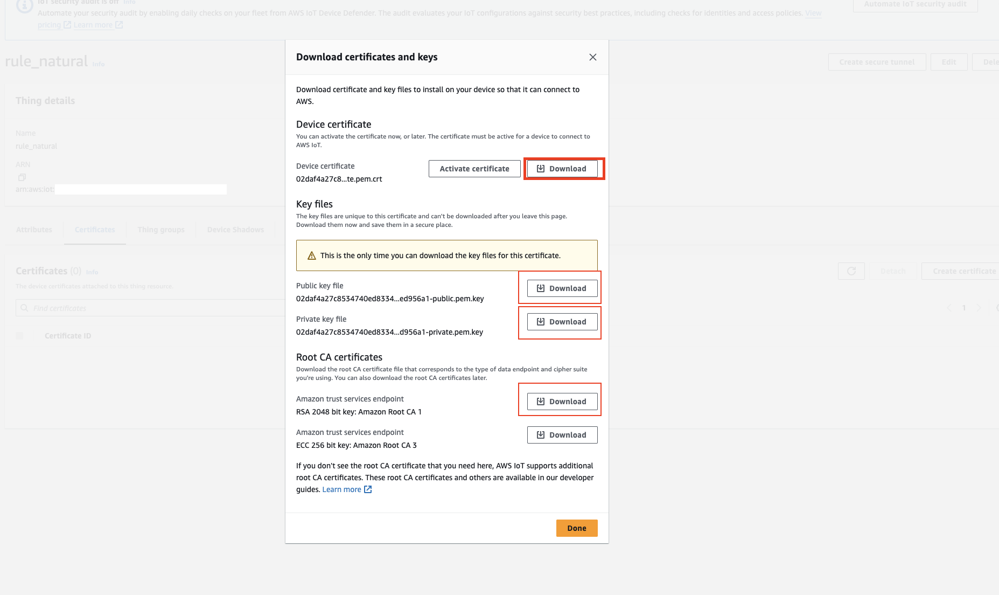

# An event-driven IoT Sensor management project on AWS


## Summary 

* [About the project](#about-the-project) 
  * [Tech stack](#built-with) 
* [How to start](#getting-started) 
  * [Prerequisites](#prerequisites) 
  * [Installation](#installation) 
* [Usage](#usage) 
* [Roadmap](#roadmap) 
* [Contribute](#contributing) 
* [License](#license) 
* [Contact](#contact) 
* [Thanks ](#acknowledgements) 


## About the project 

The objective is to create an end-to-end event-driven AWS project, simulating an animal and species monitoring platform of an environmental preservation park, all with open source tools and the AWS public cloud. 


### Technology stack 
Some tools and frameworks were used to deploy this stack, including:

* [Node Red](https://nodered.org): Creation of the farm or where the sensors are there
* [Serverless](https://serverless.com): Lambda functions 
* [Terraform](https://terraform.io): Setup of AWS services and products 
* [Docker](https://docker.com): For containers and microservices 
* [Telegram](https://core.telegram.org/bots): In order to receive notifications 

The stack itself is intended to be all code-oriented, IaC, so you won't need to create anything in the AWS console, everything is done on command line.


## Installation and deployment 

Let's go quickly, here are the prerequisites to start the setup and deployment: 


### Prerequisites 

What you will need already configure and install, look on the vendor's websites for instructions on how to install and configure: 

* [AWS-CLI](https://aws.amazon.com/pt/cli/) 
* [Docker-compose](https://docs.docker.com/compose/) 
* [Serverless](https://www.serverless.com/framework/docs/getting-started/) 


### Step 1 - Clone the repository 

1. Clone the repository 
```sh 
git clone https://github.com/metao1/iot-event-streaming-aws.git 
``` 

### Step 2 - Lambda Functions 

1. Creating your Lambda functions 
```sh 
cd serverless/ 
``` 
2. Configure the Telegram TOKEN and ChatId where you want to receive notifications: 
` ``sh 
vi serverless.env.yml 
``` 
3. Install all dependencies of the serverless framework, inside the iot-telegram folder: 
```sh
npm install 
``` 
4. Now it's time to deploy: 
```sh 
serverless deploy 
``` 
5. Configure your bot's webhook, after completing step 4, you should receive the link to your function, then, configure the webhook as follows: 
```sh 
curl -X POST https:/xxxxxxxxx/prod/set_webhook 
``` 
Pay attention to the return message, the message/string "ok" should appear. 

6. Finally, see the details of your functions that were installed: 
```sh 

aws lambda list-functions 
``` 
Look for the ARN of the notification function, the string is similar to the one below: 

```sh 
aws lambda get -function --function-name=iot-telegram-dev-notification | grep FunctionArn 
``` 
    FunctionArn = "arn:aws:lambda:REGION:XXXXXXXXX:function:iot-telegram-dev-notification" 

Save the Lambda function string, which is in quotation marks "", you will use it shortly in the code Terraform to climb Thing. 

Take a look at your AWS account's dashboard and see if the functions are already applied for validation. 


### Step 3 - Deploy AWS resources - IoT 

1. Create certificates for IoT devices 

Certificates for IoT devices, Things, are necessary to guarantee secure and end-to-end encrypted communication, so in this case I chose to follow AWS's recommendation and create the certificates in the account dashboard. It's not complicated at all, see the link below: 

https://docs.aws.amazon.com/iot/latest/developerguide/device-certs-create.html

Download the certificates, you will use them later to configure Node Red. 

Get the Certificate ARN 

To get the certificate ARN, run the command below: 

```sh 
aws iot list-certificates 
``` 
The certificate ARN looks like arn:aws:iot:REGION:xxxxxxxxx:cert/um_grande_hash

Now it's time to edit the files to upload resources to AWS.

#### terraform structure: yeap we use terraform for deployment

```
terraform/
└── modules/    
    ├── api_gw/
    ├── cloudwatch/
    ├── iot/
    └── lambda/
- main.tf    
```

Export AWS account id value to the environment variable.

```sh
export AWS_ACCOUNT_ID=$(aws sts get-caller-identity --query Account --output text)
export AWS_REGION = "<AWS_REGION>"
```


3. Edit the deploy, I setup the files below, to configure the details of the deploy

```sh
cd terraform

touch terraform.tfvars # this will create a file for setting terraform varaible files securely

nano terraform.tfvars
``` 
  - terraform.tfvars: edit the variables, especially AWS_ACCOUNT_ID,AWS_REGION with specified values in env variables which you captured in the previous step


4. Start terraform in the terraform folder 
```sh 
terraform init 
``` 
5. Now is the time to validate the deploy plan 
```sh 
terraform plan -out=plano.out 
``` 
6. The time has come to deploy the resources on AWS 
```sh 
terraform apply plano.out 
```
Cross your fingers, I would recommend getting a coffee, but it will be quick. 

Once created, take a general look at the dashboard to see with your own eyes the work done by the code. 

7. Create secure communication between IoT devices and our AWS IoT MQTT broker is vital. We need to create relevent certificates on AWS Console (intentinally manually easy step)
Head over to AWS Core and select Thing from the left navigation bar as show in the image below.


Click over 'rule_natural' and then select 'certificates' tabs. Click over 'Create certificate' butto to create new certificates.


In the shown dialog, download all certificates. !!Remember to download them now!!



After downloading certificates, we can see the a resource with link in 'Certificates' is created. This is in 'inactive' mode, we need to activate it in next step.


Click on the link, and then select 'attach policy'.


From 'Choose AWS iot policy' drop-down in the dialog, select 'iot_rule_national_policy'


Copy 'certificate arn' that has the following format

```sh
"arn:aws:iot:<AWS_REGION>:<ACCOUNT_ID>:cert/<CERT_ID>"
```

Edit the 'terraform.tfvars' and paste the value in the 'iot_cert_arn'

```sh
nano terraform.tfvars
``` 
  - terraform.tfvars: pase the variable, iot_cert_arn


### Step 4 - Deploy sensors and devices in the National Conservation Park 

1. Here you will need docker and docker-compose installed on your computer 
```sh 
cd docker 
docker-compose up -d 

``` 
2. Now , access nodered in your browser at: http://127.0.0.1:1880 

3. Install the random node, as it generates the sensor data and simulations 

  https://flows.nodered.org/node/node- red-node-random 

4. Import the event flow that is inside the docker folder, the flow.json file 

  https://nodered.org/docs/user-guide/editor/workspace/import-export 

5. Configure the node red to access your Thing, which was created in step 3 


## Roadmap 

Let's keep this code and include new features. 


## License 

Distributed under the MIT license. See the LICENSE file for more information. 


